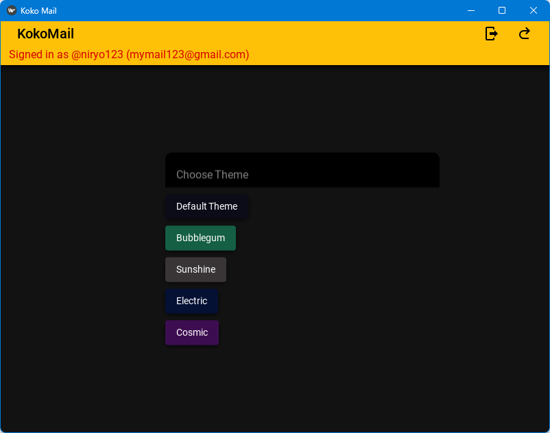

# 📬 Koko Mail
**Koko Mail** is a mail networking project.  
* **_Traffic_**: TCP
* **_UI_**: KivyMD

---

## 🐍 Features

- A functional UI for the mailing app that includes:
    - Register & Login & Logging out
    - Creating mails through a form & attaching files
    - Viewing mailbox, searching through mails
    - Marking mails as spam / important
    - View sent mails
    - View specific mail & download attachments
    - Highlight unread mails in mailbox
    - Settings page to change app theme color

- A protocol to talk between the client and the server that includes:
    - User authentication (auth codes)
    - Sending structured data and raw data!
    - My own JSON serializer and deserializer for structured data communication
    - TLS layer for secure traffic
    - Storing all the data in a database (sqlite)

---

## 📷 Pictures

---

## 🪢 Protocol
#### [size 4 bytes][who 1 byte][type 1 byte][api route 4 bytes][json/raw size header - 5…]
**Who:**
- c (Client to Server)
- s (Server to Client)

**Type:** 
- 0 (json - the way to transfer data)
- 1 (raw - ie: files…)
- 2 (error - in a JSON format {“error_code”: _, “error”: “...”})

#### Protocol in Code
The server has a function that handles all of the valid
routes (SERVER_ROUTES). After handling a route it sends
a response to the client, which handles the response of
the server (CLIENT_ROUTES[handler]), though usually it
doesn’t followup with a new message (but it can).

## ⌚ API Routes
| ROUTE | NAME             | INPUT                     | OUTPUT                                                                              |
|-------|------------------|---------------------------|-------------------------------------------------------------------------------------|
| RGST  | Register         | username, email, password | create account + return auth                                                        |
| LOGN  | Login            | username, password        | return auth                                                                         |
| LOUT  | Log Out          | auth                      | \---                                                                                |
| MLST  | Mail List        | auth                      | return list of mails ([id, tag(archived,starred,spam,sent), author, subject, body]) |
| SEND  | Send Mail        | auth, to, subject, body   | return mail id                                                                      |
| FILE  | Add File to Mail | auth, raw file            | \---                                                                                |
| MAIL  | Get Mail         | auth, mail id             | return author, subject, body, \*files                                               |
| GFLE  | Get File         | auth, mail id, filename   | return raw file                                                                     |
| SPAM  | Toggle Spam      | auth, mail id             | \---                                                                                |
| IMPT  | Toggle Important | auth, mail id             | \---                                                                                |
| MSNT  | Get Sent Mails   | auth                      | return list of mails that the user sent                                             |

 

- **[RGST]** <u>REGISTER</u>: username, email, password  ⇒ create account + return auth
- **[LOGN]** <u>LOGIN</u>: username, password ⇒ return auth
- **[LOUT]** <u>LOG OUT</u>: auth
- **[MLST]** <u>MAILLIST</u>: auth ⇒ return list of mails ([id, tag(archived,starred,spam,sent), author, subject, short body])
- **[SEND]** <u>SEND</u>: auth, to, subject, body ⇒ return id
- **[FILE]** <u>ADD FILE</u> (to previous mail): auth, raw file
- **[MAIL]** <u>MAIL</u>: auth, id ⇒ author, subject, body, *files
- **[GFLE]** <u>GET FILE</u>: auth, id, filename → raw file
- **[SPAM]** <u>TOGGLE MARK AS SPAM</u>: auth, id
- **[IMPT]** <u>TOGGLE MARK AS IMPORTANT</u>: auth, id
- **[MSNT]** <u>SENT MAILLIST</u>: auth → return list of mails that the user sent